# Delta Backend Architecture

## System Overview

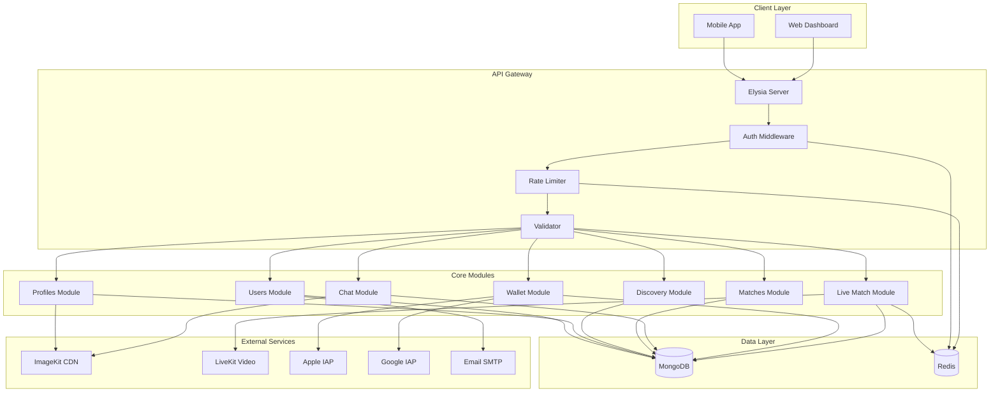

## Module Dependencies

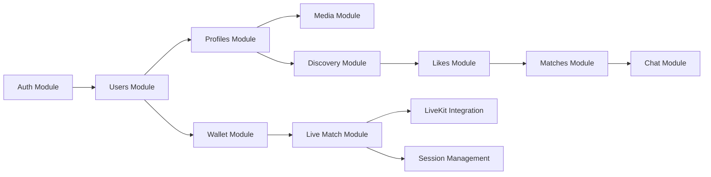

## Data Flow: User Registration to First Match

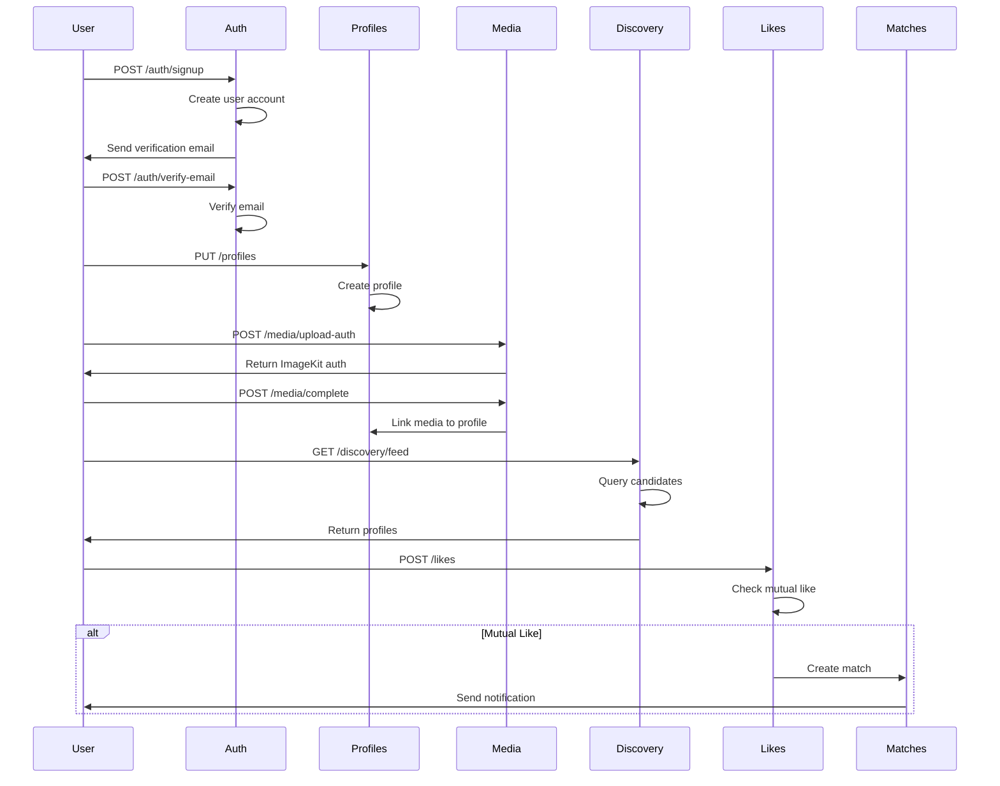

## Data Flow: Live Match Session

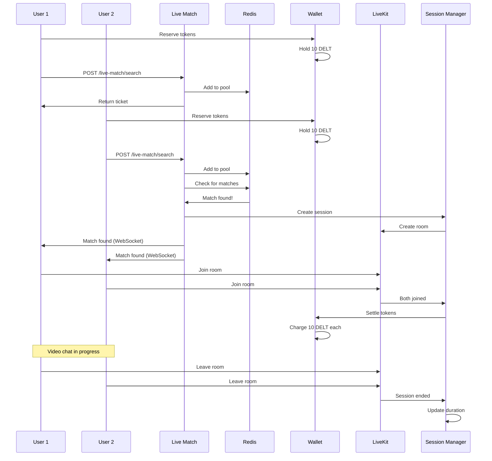

## Database Schema Relationships

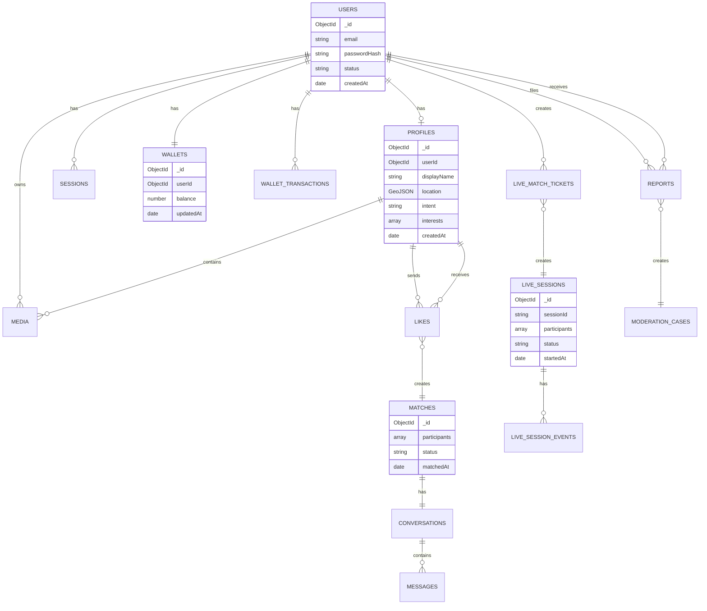

## Token Economy Flow

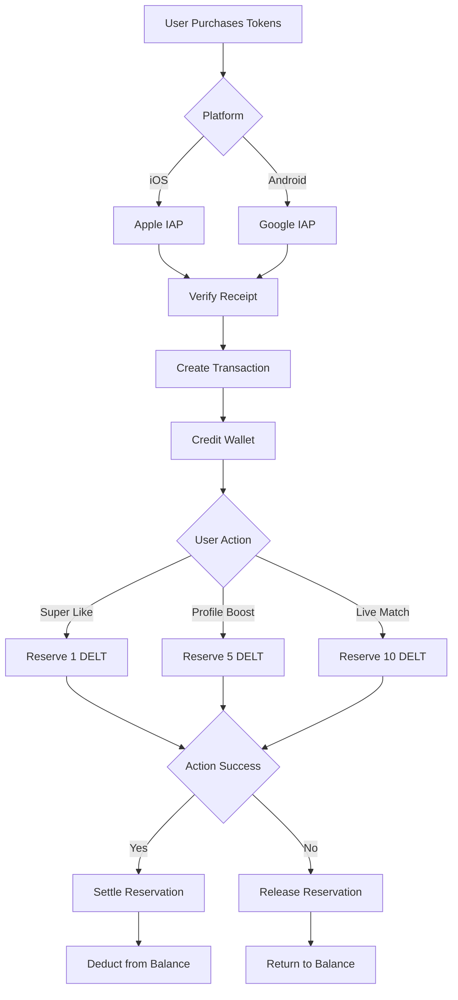

## Live Matching Pool Structure

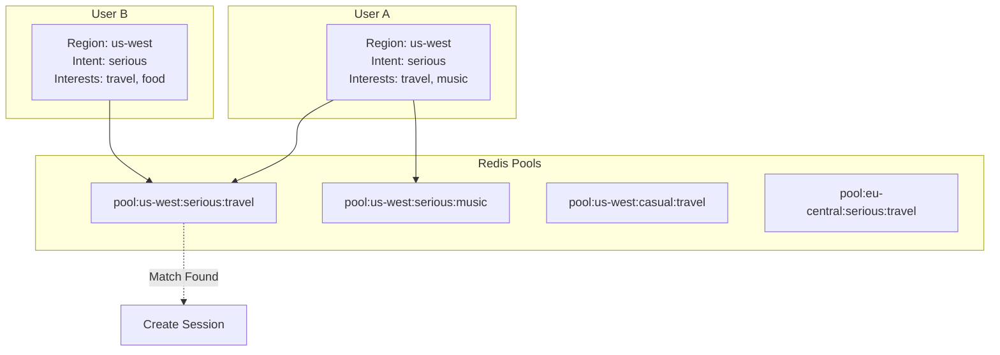

## Middleware Stack

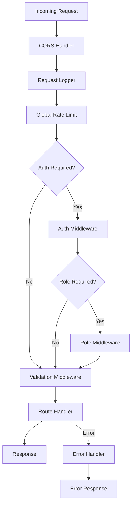

## Geospatial Discovery Query

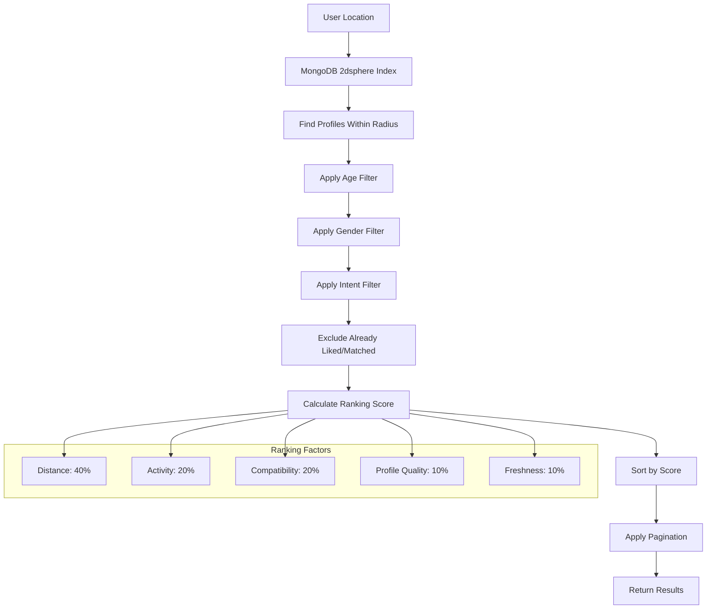

## Session State Machine

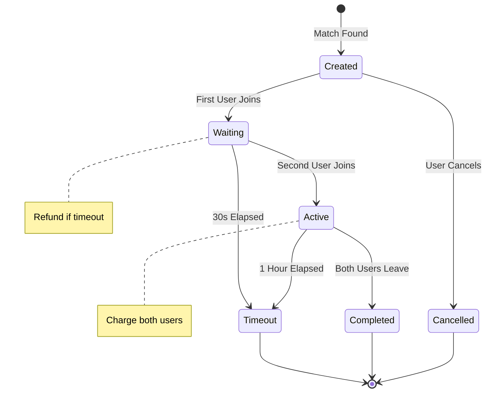

## Error Handling Flow

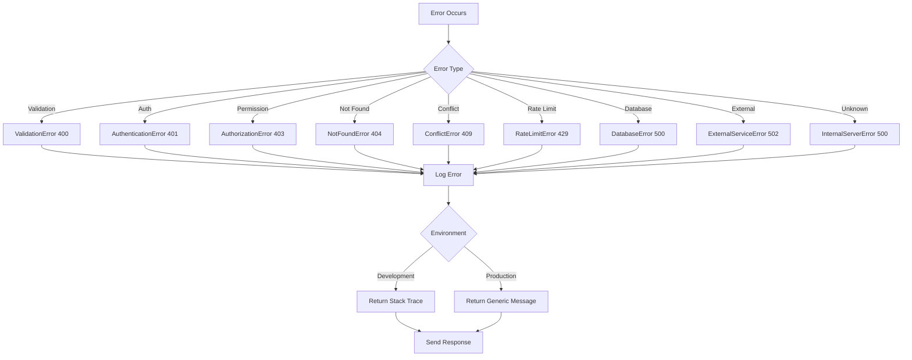

## Deployment Architecture

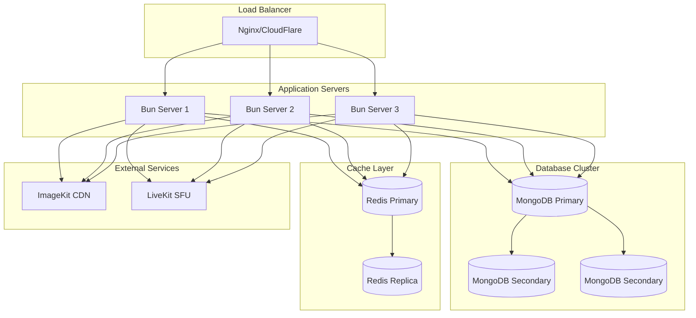

## Performance Optimization Strategy

### Database Indexes
- **Geospatial**: 2dsphere index on `profiles.location`
- **Compound**: `(userId, createdAt)` for user-specific queries
- **TTL**: Automatic expiration for sessions and tickets
- **Unique**: Email, phone, fileId for data integrity

### Caching Strategy
- **Session Data**: Redis (fast access)
- **Rate Limits**: Redis (sliding window)
- **Live Match Pools**: Redis (real-time matching)
- **User Preferences**: Redis (frequently accessed)

### Query Optimization
- **Pagination**: Cursor-based for large datasets
- **Projection**: Only fetch required fields
- **Aggregation**: Pipeline optimization for complex queries
- **Connection Pooling**: Reuse database connections

### Scalability Considerations
- **Horizontal Scaling**: Stateless API servers
- **Database Sharding**: By user ID or region
- **CDN**: Static assets via ImageKit
- **WebSocket**: Separate server for real-time features
- **Background Jobs**: Queue system for async tasks

---

This architecture supports:
- ✅ High availability with load balancing
- ✅ Horizontal scalability
- ✅ Real-time features via WebSocket
- ✅ Efficient geospatial queries
- ✅ Secure payment processing
- ✅ Content moderation pipeline
- ✅ Comprehensive monitoring